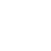

# Next CRUD Produtos

Sistema completo de gerenciamento de produtos (CRUD) desenvolvido com Next.js 15.



## 🚀 Stack Tecnológica

- **Next.js 15** - Framework React com App Router, Server Components e API Routes
- **React 18** - Biblioteca de construção de interfaces com Hooks e Context API
- **TypeScript** - Tipagem estática para desenvolvimento escalável
- **Zustand** - Gerenciamento de estado global leve e poderoso
- **Tailwind CSS** - Estilização avançada com responsividade e suporte nativo a dark mode
- **Hero UI** - Biblioteca de componentes modernos e acessíveis
- **Zod** - Validação de dados e tipagem em runtime
- **Chart.js** - Visualização de dados em gráficos interativos
- **Sonner** - Toast notifications elegantes e acessíveis

## 💻 Funcionalidades Principais

### Gerenciamento de Produtos (Página Principal)

- **Listagem de Produtos**: Tabela completa com paginação, filtros e busca
- **Dashboard de Métricas**: Cards informativos e gráficos de análise
- **CRUD Completo**:
  - Criação de produtos com upload de imagens (drag-and-drop e validação)
  - Visualização detalhada em modal
  - Edição de todos os campos, incluindo status e imagem
  - Exclusão com modal de confirmação
- **Experiência de Usuário Avançada**:
  - Design responsivo (mobile, tablet e desktop)
  - Suporte a dark/light mode
  - Animações e transições suaves
  - Toast notifications para feedback de ações
  - Drag-and-drop para upload de imagens
  - Validação de entrada de dados (incluindo limite de tamanho de arquivos 5MB)

### Arquitetura e Padrões Avançados

- **Componentização Extensiva**: Código modular e reutilizável
- **Gerenciamento de Estado**: Stores com Zustand para dados globais
- **Tipagem Robusta**: TypeScript em toda a aplicação
- **Pattern de Services**: Abstração de chamadas API
- **Acessibilidade**: Componentes e interações acessíveis (WCAG)
- **SEO Otimizado**: Meta tags e estrutura semântica

## � Como Executar o Projeto

### Requisitos

- Node.js 18.x ou superior
- NPM 9.x ou superior

### Instalação

```bash
# Clone o repositório
git clone https://github.com/GustavoRSL/next-produtos.git

# Acesse a pasta do projeto
cd next-crud-produtos

# Instale as dependências
npm install
```

### Executando o Projeto

```bash
# Desenvolvimento com hot-reload (usando Turbopack)
npm run dev

# ou sem Turbopack
npm run dev:no-turbo

# Gerar build de produção
npm run build

# Iniciar em modo produção
npm start
```

Após iniciar o servidor de desenvolvimento, acesse [http://localhost:3000](http://localhost:3000)

### Scripts Disponíveis

| Comando          | Descrição                                           |
|------------------|-----------------------------------------------------|
| `npm run dev`    | Inicia servidor de desenvolvimento com Turbopack    |
| `npm run build`  | Gera build otimizado para produção                  |
| `npm start`      | Inicia aplicação em modo produção                   |
| `npm run lint`   | Executa linting e correção automática de código     |

## 📁 Estrutura do Projeto

```
.
├── app/                  # App Router (Next.js 15)
│   ├── auth/             # Autenticação (mockada)
│   ├── dashboard/        # Dashboard com gráficos
│   ├── produtos/         # Principal: CRUD de produtos
│   ├── api/              # Rotas de API
│   └── layout.tsx        # Layout principal com providers
├── components/           # Componentes reutilizáveis
│   ├── charts/           # Gráficos com Chart.js
│   ├── layout/           # Componentes de layout
│   ├── produtos/         # Componentes específicos de produtos
│   └── ui/               # Componentes de UI genéricos
├── lib/
│   ├── services/         # Serviços para comunicação com API
│   ├── stores/           # Gerenciamento de estado global (Zustand)
│   ├── utils/            # Funções utilitárias
│   └── validations/      # Esquemas de validação com Zod
├── public/               # Ativos estáticos
├── styles/               # Estilos globais
└── types/                # Tipagens TypeScript
```

## � Destaque: CRUD de Produtos (/app/produtos)

O gerenciador de produtos é a funcionalidade principal deste projeto, implementando:

1. **Interface Responsiva**: Layout adaptável para todos os dispositivos
2. **Filtros e Busca**: Sistema de filtragem com debounce e feedback instantâneo
3. **Upload de Imagens**: Suporte para drag-and-drop e validações
4. **Componentes Avançados**:
   - `ProductFormModal`: Formulário modal para criação/edição
   - `DeleteConfirmationModal`: Confirmação visual para exclusão
   - `ProductsTable`: Tabela de produtos com acesso às operações
   - `StatCard`: Cards de estatísticas
   - `SearchFilter`: Filtro de busca com otimizações
   - `Pagination`: Paginação de resultados

5. **Toast Notifications**: Feedback visual de ações com `sonner`
6. **Validação de Uploads**: Implementa verificação de tipo e limite de tamanho (5MB)

## ⚙️ Funcionalidades Técnicas

- **Componentes Server/Client**: Separação correta para otimização
- **Funções Específicas**: Cada componente tem responsabilidade única
- **Estados Globais**: Gerenciamento centralizado com Zustand
- **Tratamento de Erros**: Feedback visual para o usuário
- **Otimizações de Performance**:
  - Debounce em buscas
  - Carregamento otimizado de imagens
  - Estados locais vs globais
  - Paginação eficiente

## 📱 Responsividade

O projeto é 100% responsivo, adaptando-se a diferentes tamanhos de tela:

- **Mobile**: Layout vertical, navegação compacta
- **Tablet**: Aproveitamento de espaço intermediário
- **Desktop**: Experiência completa com todas as funcionalidades

## 🌙 Dark Mode

Implementação completa de Dark/Light Mode usando:
- `next-themes` para persistência de preferência
- Design system adaptável (variáveis CSS e Tailwind)
- Transições suaves entre modos

## ⚙️ Configuração de Ambiente (.env)

O projeto utiliza variáveis de ambiente para configuração flexível. Crie um arquivo `.env.local` na raiz do projeto com as seguintes configurações:

```bash
# API Configuration
NEXT_PUBLIC_API_URL=https://api.example.com

# Development
NODE_ENV=development
```

### Variáveis de Ambiente Disponíveis

| Variável | Descrição | Padrão |
|----------|-----------|--------|
| `NEXT_PUBLIC_API_URL` | URL base da API externa | `https://api.example.com` |
| `NODE_ENV` | Ambiente de execução | `development` |

### Ambientes

O projeto está configurado para diferentes ambientes:
- **Desenvolvimento**: Variáveis de `.env.local` têm precedência
- **Produção**: Defina as variáveis no seu ambiente de hospedagem
- **Teste**: Configure `.env.test` para testes automatizados

> **Nota**: Os arquivos `.env*.local` são ignorados pelo Git para proteção de credenciais.

## 👨‍💻 Desenvolvido por

[Gustavo Reis Souza Lima] - [GustavoRSL]
